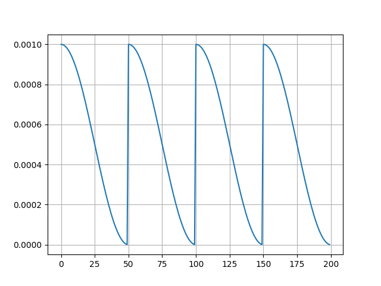
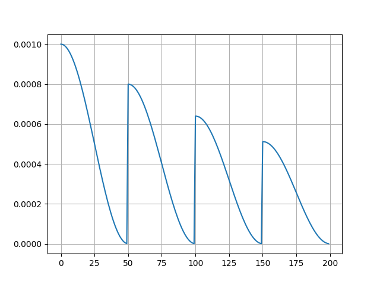
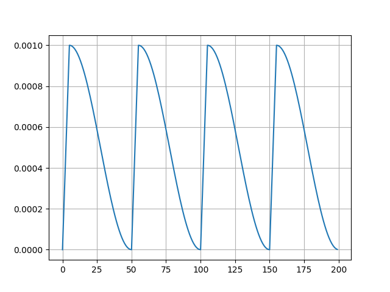
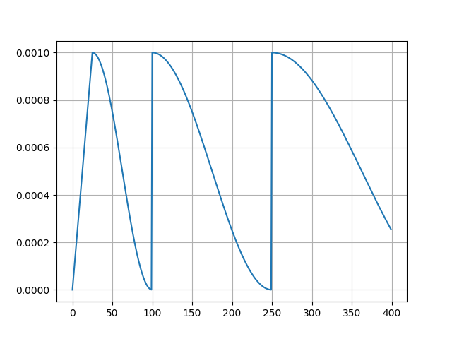
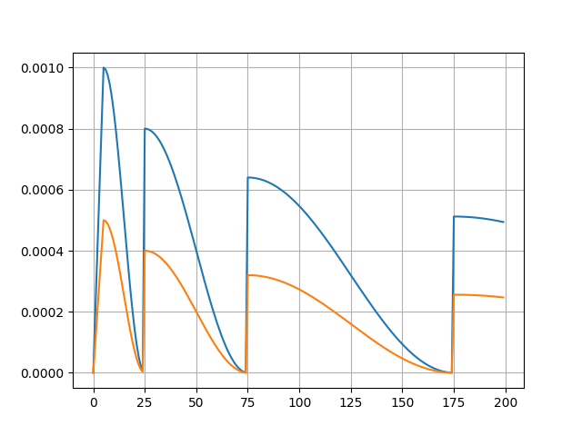

# Torch Cosine Annealing


Implementation of cosine annealing scheduler introduced in [SGDR](https://arxiv.org/abs/1608.03983) paper. Compared to the [original](https://pytorch.org/docs/stable/generated/torch.optim.lr_scheduler.CosineAnnealingWarmRestarts.html) implementation, it has the following additional features:
- Support linear warm-up/burn-in period
- Linear warm-up can be applied only to the first cycle
- Support float values for the warmup period, cycle period ($T_0$), and cycle_mult ($T_{mult}$)
- Support multiple learning rates for each param group
- Scheduler can be updated by epoch or step progress

## Installation
```bash
pip install torch-cosine-annealing
```

## Quick Start
In the following examples, assume any standard PyTorch `model` and `optimizer` are defined.
### Using `step` Strategy
```python
from torch_cosine_annealing import CosineAnnealingWithWarmRestarts

scheduler = CosineAnnealingWithWarmRestarts(
    optimizer, 
    cycle_period=50, 
    cycle_mult=1, 
    warmup_period=5, 
    min_lr=1e-7, 
    gamma=1, 
    strategy='step',
)

for epoch in range(100):
    for data in dataloader:
        # insert training logic here
        
        scheduler.step()
```
### Using `epoch` Strategy
```python
from torch_cosine_annealing import CosineAnnealingWithWarmRestarts

scheduler = CosineAnnealingWithWarmRestarts(
    optimizer, 
    cycle_period=1, 
    cycle_mult=1, 
    warmup_period=0.1, 
    min_lr=1e-8, 
    gamma=1, 
    strategy='epoch',
)

for epoch in range(100):
    for i, data in enumerate(dataloader):
        # insert training logic here
        
        scheduler.step((epoch * len(dataloader) + i + 1) / len(dataloader))
```

## Arguments
The `CosineAnnealingWithWarmRestarts` class has the following arguments:
- **optimizer** (`Optimizer`): PyTorch optimizer
- **cycle_period** (`Union[float, int]`): The period for the first cycle. If strategy is 'step', this is the number of steps in the first cycle. If strategy is 'epoch', this is the number of epochs in the first cycle.
- **cycle_mult** (`float`): The multiplier for the cycle period after each cycle. Defaults to 1.
- **warmup_period** (`Union[float, int]`): The period for warmup for each cycle. If strategy is 'step', this is the number of steps for the warmup. If strategy is 'epoch', this is the number of epochs for the warmup. Defaults to 0.
- **warmup_once** (`bool`): Whether to apply warmup only once at the beginning of the first cycle. Only affects when warmup_period > 0. Defaults to False.
- **max_lr** (`Union[float, List[float]]`, optional): The maximum learning rate for the optimizer (eta_max). If omitted, the learning rate of the optimizer will be used. If a float is given, all lr in the optimizer param groups will be overridden with this value. If a list is given, the length of the list must be the same as the number of param groups in the optimizer. Defaults to None.
- **min_lr** (`float`, optional): The minimum learning rate for the optimizer (eta_min). Defaults to 1e-8.
- **gamma** (`float`, optional): The decay rate for the learning rate after each cycle. Defaults to 1.
- **strategy** (`str`, optional): Defines whether the cycle period and warmup period to be treated as steps or epochs. Can be `step` or `epoch`. Note that if you use `epoch`, you need to specify the epoch progress each time you call `.step()`. Defaults to `step`.

## Use Cases
### Restart every 50 steps without warmup, no decay, constant restart period
```strategy='step', cycle_period=50, cycle_mult=1, max_lr=1e-3, min_lr=1e-7, warmup_period=0, gamma=1```

### Restart every 1 epoch without warmup, decay learning rate by 0.8 every restart, constant restart period
**Note**: In this example, one epoch consists of 50 steps.

```strategy='epoch', cycle_period=1, cycle_mult=1, max_lr=1e-3, min_lr=1e-7, warmup_period=0, gamma=0.8```

### Restart every 50 steps with 5 steps warmup, no decay, constant restart period
```strategy='step', cycle_period=50, cycle_mult=1, max_lr=1e-3, min_lr=1e-7, warmup_period=5, gamma=1```

### Restart every 2 epoch with 0.5 epoch warmup only on first restart, no decay, restart period multiplied by 1.5 every restart
**Note**: In this example, one epoch consists of 50 steps.

```strategy='epoch', cycle_period=2, cycle_mult=1.5, max_lr=1e-3, min_lr=1e-7, warmup_period=0.5, warmup_once=True, gamma=1```


### Restart every 25 steps with 5 steps warmup only on first restart, decay learning rate by 0.8 and restart period multiplied by 1.5 every restart, apply to multiple learning rates
```strategy='step', cycle_period=25, cycle_mult=2, max_lr=[1e-3, 5e-4], min_lr=1e-7, warmup_period=5, warmup_once=True, gamma=0.8```

